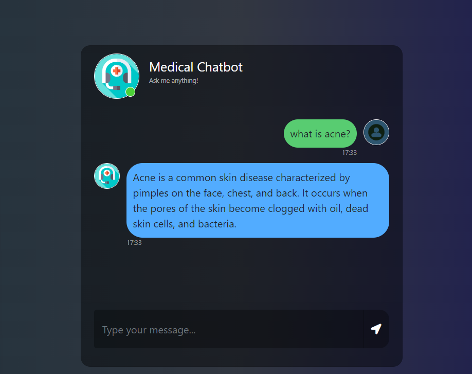

# MedicalChatBox


##  Steps to Run the project 

- Create My Environment ==>
```bash
conda create -n mchb
```
    

- Activate Environment 
```bash
conda activate mchb

```

- Install Requirements     
```bash
pip instal -r requirements.txt 
```

### STEP 02- install the requirements
```bash
pip install -r requirements.txt
```

### Create a .env file in the root directory and add your Pinecone credentials as follows:
```bash
PINECONE_API_KEY = "xxxxxxxxxxxxxxxxxxxxxxxxxxxxx"
PINECONE_API_ENV = "xxxxxxxxxxxxxxxxxxxxxxxxxxxxx"
```

### Download the quantize model from the link provided in model folder & keep the model in the model directory:
```bash
## Download the Llama 2 Model:

llama-2-7b-chat.ggmlv3.q4_0.bin


## From the following link:
https://huggingface.co/TheBloke/Llama-2-7B-Chat-GGML/tree/main

```
## Main Screen
